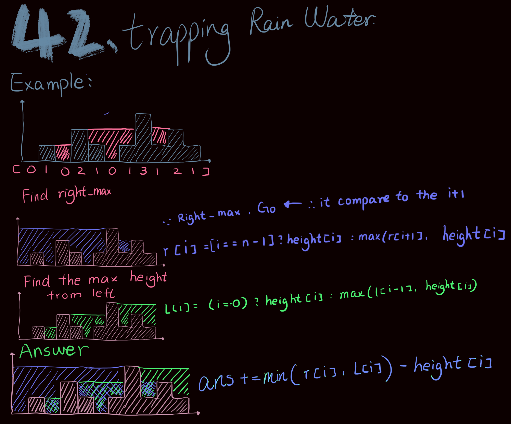

<h4>CPP Solution</h4>

```php
class Solution {
public:
    int trap(vector<int>& height) {
        int n = height.size();
        vector<int> l(n);
        vector<int> r(n);
        int res = 0;
        for(int i = 0; i < n; ++i){
            l[i] = (i == 0) ? height[i] : max(l[i-1], height[i]);
        }
        for(int i = n-1; i >= 0; --i){
            r[i] = (i == n-1) ? height[i] : max(r[i+1], height[i]);
        }
        for(int i = 0; i < n; ++i){
            res += min(l[i],r[i])-height[i];
        }
        return res;
    }
};
```
<h4>JAVA Solution</h4>

```php
class Solution {
    public int trap(int[] height) {
        int ans = 0;
        int n = height.length;
        int [] l = new int[n];
        int [] r = new int[n];
        for(int i = 0; i < n; i++){
            l[i] = (i == 0)? height[i]: Math.max(l[i-1],height[i]);
        }
        for(int i = n-1; i >= 0; i--){
            r[i] = (i == n-1)? height[i]: Math.max(r[i+1],height[i]);
        }
        for(int i = 0; i < n; i++){
            ans += Math.min(l[i],r[i]) - height[i];
        }
        return ans;
    }
}
```
