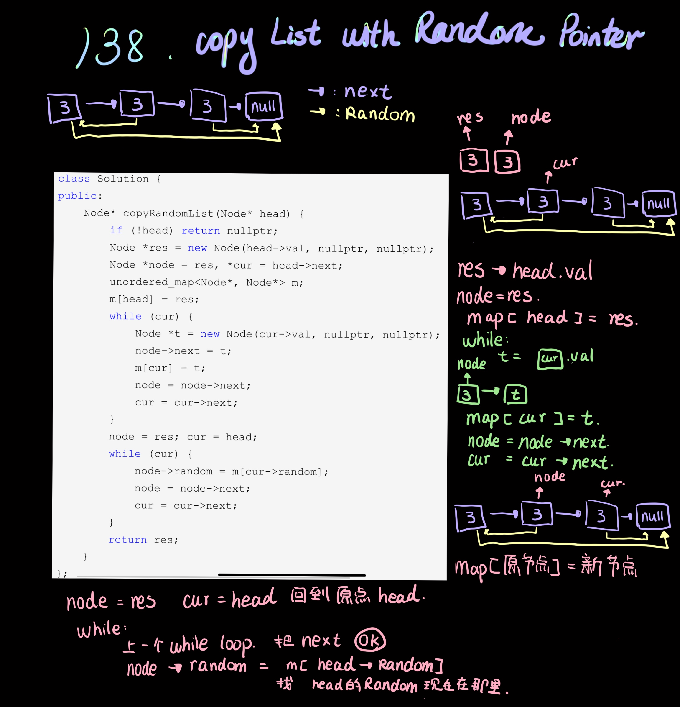

```php

class Solution {
public:
    Node* copyRandomList(Node* head) {
        if(!head) return nullptr;
        Node *res = new Node(head->val, nullptr, nullptr);
        Node *node = res, *cur = head->next;
        unordered_map<Node*, Node*> m;
        m[head] = res;
        while(cur){
            Node *t = new Node(cur->val, nullptr, nullptr);
            node->next = t;
            m[cur] = t;
            node = t;
            cur= cur->next;
        }
        node = res; cur = head;
        while(cur){
            node->random = m[cur->random];
            node = node->next;
            cur= cur->next;
        }
        return res;
    }
};
```
Source from [138. Copy List with Random Pointer 拷贝带有随机指针的链表](https://www.cnblogs.com/grandyang/p/4261431.html)<br>
Credit by [Grand yang](https://www.cnblogs.com/grandyang/)
