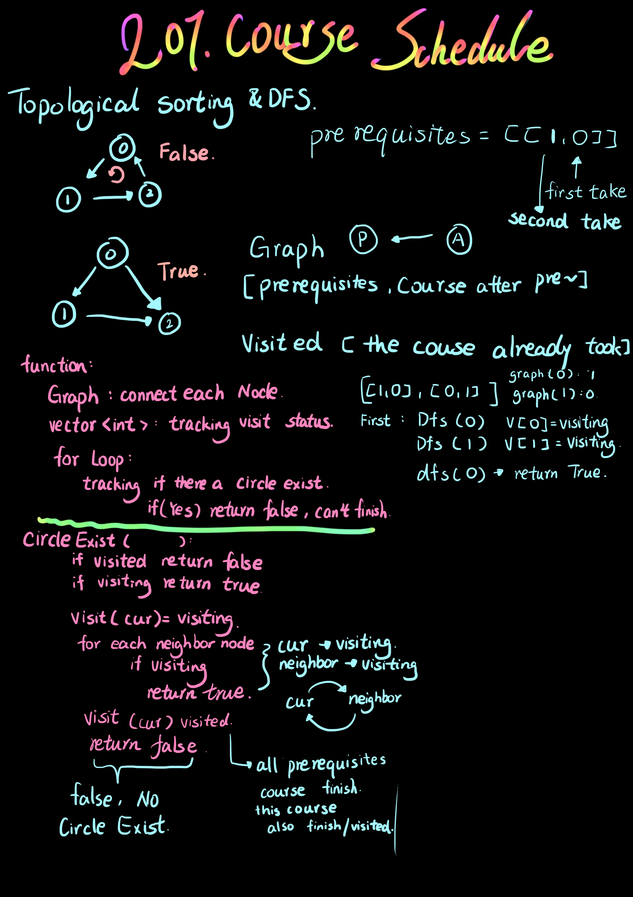

```php
class Solution {
public:
    bool canFinish(int numCourses, vector<vector<int>>& prerequisites) {
        vector<vector<int>> graph (numCourses, vector<int>());
        vector<int> visited (numCourses);
        for(auto a: prerequisites){ //graph
            graph[a[1]].push_back(a[0]);
        }
        for(int i = 0; i < numCourses; i++){
            if(CircleExist(graph, visited, i)) return false;    
        }
        return true;

    }
    bool CircleExist(vector<vector<int>>& graph, vector<int>& visited, int curr){
        if(visited[curr] == 1) return true; //visiting
        if(visited[curr] == 2) return false; //visited

        visited[curr] = 1;
        //loop neighbor (if prerequisites node also visiting, return true, that is circle exist)
        for(auto a: graph[curr]){
            if(CircleExist(graph,visited,a)) return true;
        }
        visited[curr] = 2; // course finished->visited
        return false;      
    }
};
```
Source from [花花酱 LeetCode 207. Course Schedule](http://zxi.mytechroad.com/blog/graph/leetcode-207-course-schedule/)<br>
Credit by [花花酱](https://zxi.mytechroad.com/blog/)
