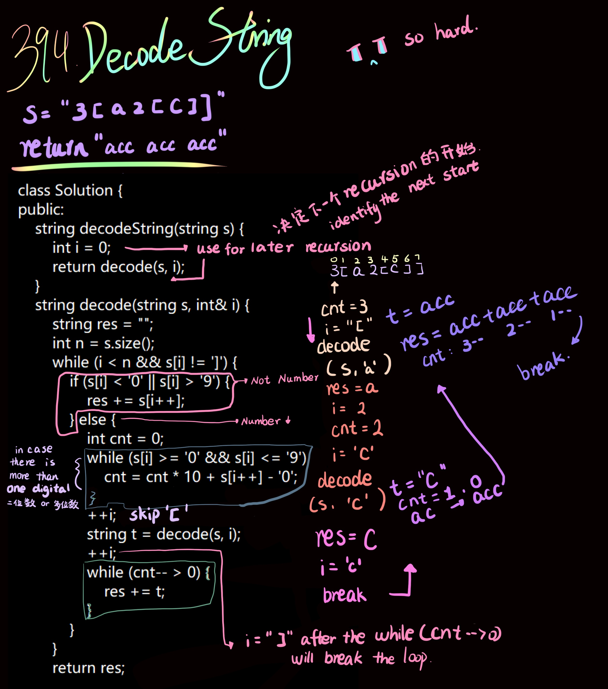

```php
class Solution {
public:
    string decodeString(string s) {
        int i = 0;
        return decode(s, i);
    }
    string decode(string s, int& i) {
        string res = "";
        int n = s.size();
        while (i < n && s[i] != ']') {
            if (s[i] < '0' || s[i] > '9') {
                res += s[i++];
            } else {
                int cnt = 0;
                while (s[i] >= '0' && s[i] <= '9') {
                    cnt = cnt * 10 + s[i++] - '0';
                }
                ++i;
                string t = decode(s, i);
                ++i;
                while (cnt-- > 0) {
                    res += t;
                }
            }
        }
        return res;
    }
};
```
Source from [LeetCode 394. Decode String 解码字符串](https://www.cnblogs.com/grandyang/p/5849037.html)<br>
Credit by [Grand yang](https://www.cnblogs.com/grandyang/)
