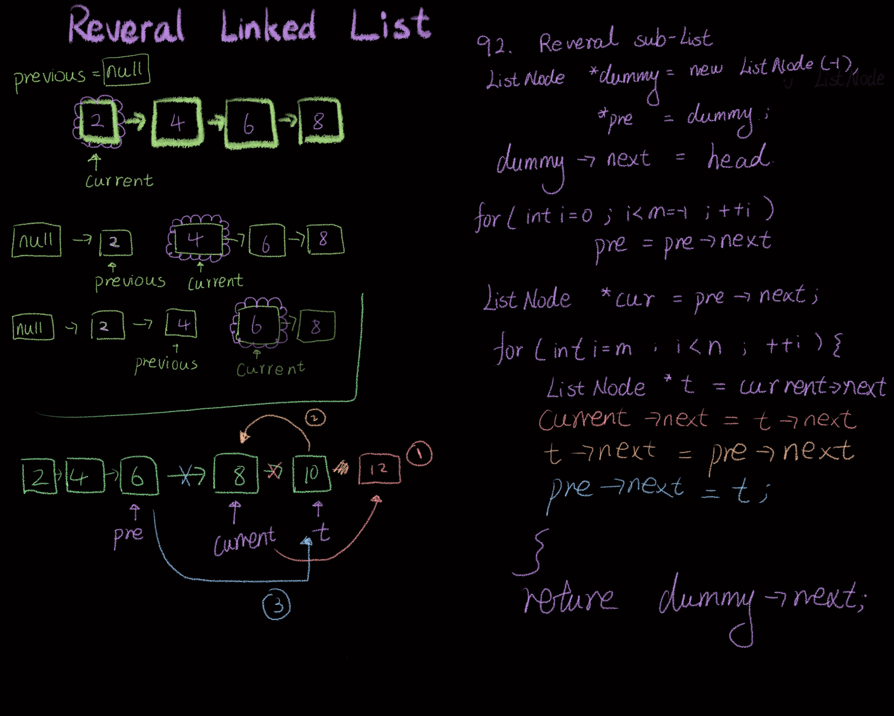

```php
class Solution {
public:
    ListNode* reverseBetween(ListNode* head, int left, int right) {
        ListNode *dummy = new ListNode(-1), *pre = dummy;
        dummy->next = head;
        for (int i = 0; i < left - 1; ++i){
            pre = pre->next;
        }
        ListNode* cur = pre->next;

        for(int i = left; i< right; ++i){
            ListNode *t = cur->next;
            cur->next = t->next;
            t->next = pre->next;
            pre->next = t;
        }
        return dummy->next;
    }
};
```
