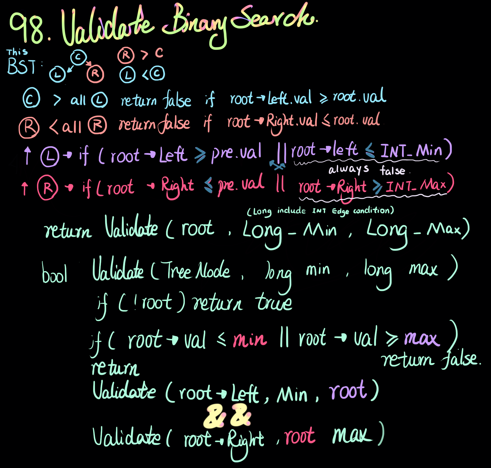

<h4>CPP Solution</h4>

```php
class Solution {
public:
    bool isValidBST(TreeNode* root) {
        return isValidBST(root, LONG_MIN, LONG_MAX);
    }
    bool isValidBST(TreeNode* root, long min, long max){
        if(!root) return true;
        if(root->val >=max || root->val <=min) return false;
        return isValidBST(root->left, min, root->val) && isValidBST(root->right, root->val, max);
    }
};
```
<h4>JAVA Solution</h4>

```php
class Solution {
    public boolean isValidBST(TreeNode root) {
        return isValidBST (root, Long.MAX_VALUE, Long.MIN_VALUE);
    }
    public boolean isValidBST(TreeNode root, long max, long min){
        if(root == null) return true;
        if(root.val >= max ||root.val <= min) return false;
        return isValidBST(root.left, root.val, min) && isValidBST(root.right, max, root.val);
    }
}
```
