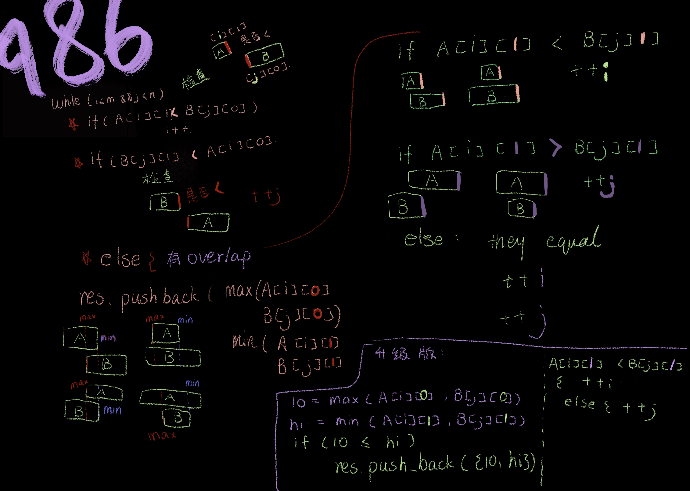

```php
class Solution {
public:
    vector<vector<int>> intervalIntersection(vector<vector<int>>& firstList, vector<vector<int>>& secondList) {
        vector<vector<int>> res;
        int i = 0, j =0;
        while(i < firstList.size() && j < secondList.size()){
            int left = max(firstList[i][0], secondList[j][0]);
            int right = min(firstList[i][1], secondList[j][1]);
            if(left <= right){
                res.push_back({left, right});
            }
            (firstList[i][1] < secondList[j][1]) ? ++i : ++j;
        }
        return res;
    }
};
```
